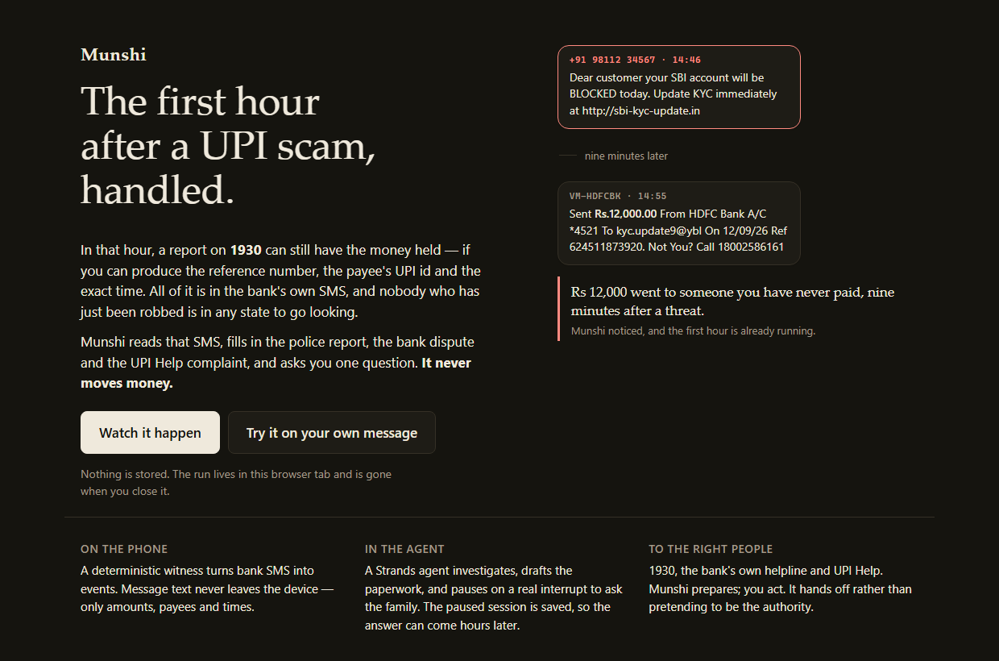
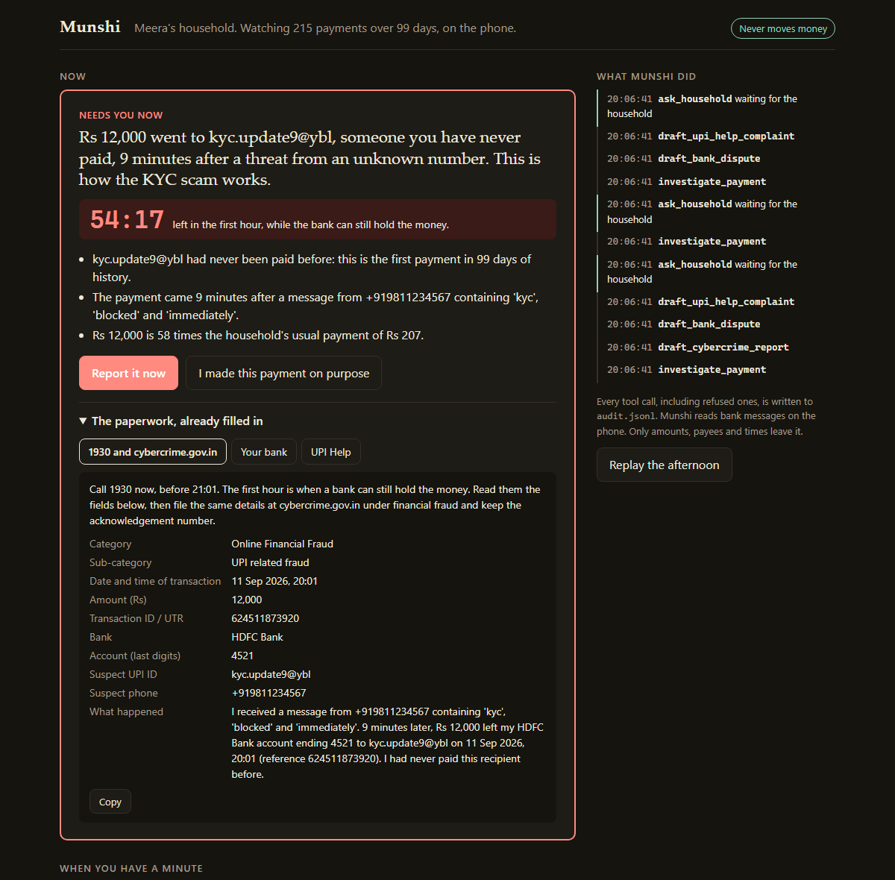

# Munshi

**The first hour after a UPI scam, handled.**

Munshi is a background agent for Indian households, built on [Strands Agents](https://strandsagents.com).
It reads the bank messages already on the family's phone. When a payment has the shape of a scam, it
investigates, fills in the 1930 / cybercrime.gov.in report, the bank dispute and the UPI Help complaint,
and asks the family one question. It never moves money: no tool can, and a hook refuses anything that tries.

Built for the AWS **Agents for Humans** hackathon, Everyday track.

### [Open it: munshi-upi.vercel.app](https://munshi-upi.vercel.app)

No install, no account. Watch it handle a scam that happened five minutes ago — or **paste your own bank SMS**
and get the real paperwork back, with your reference number in it.

[](https://munshi-upi.vercel.app)



## Why the first hour

When money goes to a scammer over UPI, the useful window is short. Reported quickly on **1930**, India's
national cyber-crime helpline, the money can sometimes be held before it moves on. That is the hour when the
person who was scammed is most frightened, and they are being asked for a transaction reference, the
payee's UPI ID, the exact time, their account's last digits and their bank's helpline.

Every one of those facts is already in the bank's own SMS. Munshi reads them and puts the finished
paperwork in front of the family, with a clock.

## What the family sees

There is no chat box on the first screen. There is one card:

- **A headline** in plain words: *Rs 12,000 went to kyc.update9@ybl, someone you have never paid,
  9 minutes after a threat from an unknown number. This is how the KYC scam works.*
- **A clock**: the minutes left in the first hour.
- **The evidence**, as sentences with numbers the ledger computed, not numbers a model wrote.
- **Two buttons**: *Report it now* or *I made this payment on purpose*.
- **The paperwork**: the 1930 and portal fields, a dispute letter with the helpline number printed in the
  bank's own message, and the UPI Help fields, each with a copy button.

After *Report it now*, the card turns into three steps. After *I made this payment on purpose*, Munshi
remembers the payee and never asks about them again. Quieter work (an order charged twice, a subscription
that renews tomorrow at a higher price) waits under *When you have a minute*. A side panel shows every tool
call the agent made.

## How it works

```mermaid
flowchart LR
  subgraph Phone["On the phone (no model, no network)"]
    SMS[Bank SMS] --> W["Witness<br/>nyaya.money parser + munshi.readers + munshi.witness"]
    W --> P["Household payload<br/>ledger rows + events<br/>no message text"]
  end
  subgraph Cloud["Amazon Bedrock AgentCore Runtime"]
    P --> O["Munshi orchestrator<br/>Strands Agent"]
    O -- tools --> T["investigate_payment<br/>draft_* x3<br/>payee_history, recent_transactions<br/>ask_household<br/>remember_trusted_payee"]
    T -- agent as tool --> I["Investigator<br/>Strands Agent<br/>structured output: Verdict"]
    H1["PolicyHook<br/>BeforeToolCallEvent"] -. refuses .-> O
    H2["AuditHook<br/>AfterToolCallEvent"] -. audit.jsonl .-> O
    O --- M["Amazon Bedrock<br/>Nova Pro by default"]
    I --- M
    T -- ask_household --> X["Interrupt<br/>session saved<br/>File or S3 SessionManager"]
  end
  X --> C["Decision card<br/>in the family's inbox"]
  C -- tap, minutes or hours later --> R["Resume the same session<br/>interruptResponse"]
  R --> O
```

1. **The witness** runs on the phone and is deterministic. It turns bank messages into ledger rows and
   raises events: a *scam-shaped payment* (a first-time payee, paid within 30 minutes of a message from a
   phone number that uses scam words), an *unusual payment*, a *double charge* with no refund, or a
   *renewal* due in the next three days. Only the ledger and the events leave the phone.
2. **The orchestrator** is a Strands agent, one session per event. Its system prompt is a short playbook:
   investigate, draft what the verdict calls for, ask the family once, act on the answer.
3. **The investigator** is a second Strands agent, called as a tool. It weighs facts the ledger computed and
   returns a `Verdict` (kind, confidence, headline, recommended action) through Strands structured output.
   If no model is configured or the call fails, rules give the same kind of verdict.
4. **`ask_household`** calls `tool_context.interrupt(...)`. The run stops, the session manager writes the
   conversation and the interrupt to disk (or S3), and the card goes to the inbox with the interrupt id.
   When the family taps a choice, possibly in another process hours later, the same session resumes from
   that exact tool call with an `interruptResponse`.

## Safety, as code rather than a prompt

- **No tool can move money.** The tools take an event id, a payee or a number of days. None takes free
  text, so no argument can carry an instruction.
- **Event data is checked, and it cannot unlock anything.** A payee's display name comes from an SMS a
  scammer can influence, so it could try to read like an instruction. Every field that reaches the agent is
  checked against the shape the witness produces (`payload.py`: a UPI id or merchant name, digits for
  references, scam words only from Munshi's own list, known evidence keys), and a hand-built or tampered
  payload is refused. The investigator is told the event is data. And the one tool that changes what
  Munshi watches, `remember_trusted_payee`, refuses unless the family chose *fine* on that payee's card;
  the runner records the family's choice itself, whatever the model does.
- **`PolicyHook`** (`BeforeToolCallEvent`) cancels any call to a tool outside the allow-list, or with an
  argument outside that tool's schema, before it runs: *Munshi never moves money and only calls its own
  tools.* The investigator gets its own allow-list, which contains only its `Verdict` output.
- **`AuditHook`** (`AfterToolCallEvent`) writes every call, refused or not, to `audit.jsonl`. The runner
  adds the one moment Strands has no after-call event for: a tool that paused to ask the family.
- **Numbers are computed, never generated.** Amounts, times, references and "58 times your usual payment"
  come from the ledger. The complaint drafts are templates filled from the bank's message. A model writes
  one headline and picks a recommendation from a closed set.
- **A safety net.** If a model finishes without asking, the witness raised the event for a reason, so the
  family gets the card anyway, with the rules' verdict and the paperwork it calls for.
- **Crash-safe asking.** If the process dies after the agent asked but before the card was saved, the next
  run finds the pending interrupt in the saved session and files the card without calling the model again.
  If it dies after the family answered, the retry closes the card without resuming twice. Writes to the
  inbox and preferences take a lock that works across processes.
- **The data rule.** Message bodies never leave the phone. A test checks that the payload holds no text.
- **The local inbox** binds to 127.0.0.1, checks the Host header (DNS rebinding) and only accepts state
  changes that are JSON with an `X-Munshi` header, which another origin cannot send without a preflight.

## The hosted demo, and why it has no database

[munshi-upi.vercel.app](https://munshi-upi.vercel.app) runs the same agent on a stateless serverless function.
That should be impossible for an agent that pauses mid-tool-call and waits for a person: the second request can
land on a different machine. So a whole run — inbox, audit log and the paused Strands session — is packed into
one string, handed to the browser, and sent back with the family's answer ([`portable.py`](munshi/portable.py)).
The agent resumes from the exact tool call that asked, and the household's state never sits on a server. Pasted
messages are read once, in memory, and never written down.

## Run it

No AWS account needed for the first run. The *playbook* model follows the system prompt's steps with no
weights, so the real Strands loop, hooks, interrupt and sessions all run:

```bash
pip install -e ".[dev]"
```

```bash
python -m munshi.run serve --model playbook
```

Open http://127.0.0.1:8765. *Replay the afternoon* starts again with the scam five minutes old.

To check this machine is ready for Bedrock (credentials, region, model access) and see exactly what is missing:

```bash
python scripts/aws_check.py
```

With Amazon Bedrock (default model `us.amazon.nova-pro-v1:0`, override with `MUNSHI_BEDROCK_MODEL`; region from
`AWS_REGION`). Credentials from `aws login` work because `botocore[crt]` is a dependency. To put an Amazon Bedrock
Guardrail on everything the model reads and writes, set `MUNSHI_GUARDRAIL_ID` (and `MUNSHI_GUARDRAIL_VERSION`,
default `DRAFT`). The guardrail screens content; the policy hook still decides which tools can run.

```bash
python -m munshi.run serve
```

With a local model through Ollama (default `qwen2.5:3b`, override with `MUNSHI_OLLAMA_MODEL`; the model must
support native tool calling in Ollama):

```bash
python -m munshi.run serve --model ollama
```

From a terminal instead of the browser:

```bash
python -m munshi.run demo --model playbook
```

```bash
python -m munshi.run decide card-<id> report --model playbook
```

## On AgentCore Runtime

`agentcore_app.py` is the entrypoint and `munshi/app.py` the handler. Each household is one AgentCore
runtime session, so its inbox and paused agent sessions live together; set `MUNSHI_S3_BUCKET` to keep the
agent sessions in S3 too. With the starter toolkit (`pip install bedrock-agentcore-starter-toolkit`) and AWS
credentials that can use Bedrock:

```bash
agentcore configure -e agentcore_app.py -rf requirements.txt -r us-east-1
```

```bash
agentcore deploy --env MUNSHI_MODEL=bedrock
```

```bash
python -m munshi.run payload --days 30 > scan.json
```

Then send it with `agentcore invoke "$(cat scan.json)" -s <a session id of 33+ characters>`, and decide with
the same session id. (`--days 30` keeps the request under Windows' command-line limit.) The phone sends:

```json
{"action": "scan", "household": {"household": "meera", "now": "...", "ledger": [...], "events": [...]}}
{"action": "decide", "card": "card-<id>", "choice": "report"}
```

## Tests

```bash
python -m pytest -q --cov=munshi
```

The agent-loop tests run the real Strands event loop, hooks, interrupts and `FileSessionManager` with a
scripted model, including a call to a `send_money` tool that must be refused and audited, and a decision
resumed by a fresh process that only has the files on disk.

## What was here before, and what is new

Munshi uses **`nyaya.money`** from [nyaya](https://github.com/let-the-dreamers-rise/nyaya), the author's
earlier MIT project, pinned to one commit. From it come the SMS parser, its list of scam words and the
synthetic 100-day household used in the demo, with nyaya's own scam removed. The dependency is not
modified: the formats it cannot read on its own (SBI's currency-less "debited by 2500.0", a payee hidden
behind "trf to", a merchant on an Axis card line, a mandate notice that is not a payment yet) are repaired
in `munshi/readers.py`, against a corpus of real formats in `tests/test_readers.py`.

Everything in this repository was written for the hackathon: the events (scam-shaped payment, double
charge, renewal), the payload contract, the complaint drafts, the Strands agents and tools, the policy and
audit hooks, the interrupt and resume flow, the investigator, the playbook model, the inbox, the AgentCore
entrypoint and the tests.

## Where it sits

- **1930** and **cybercrime.gov.in** are run by the Indian Cyber Crime Coordination Centre. **UPI Help**
  is NPCI's complaint flow inside UPI apps. Munshi replaces none of them. It fills in their forms and sends
  the family to them, fast.
- In the US, Rocket Money's Rowan is an agent for bills and subscriptions. Munshi does that quiet work too,
  but it leads with the hour after a scam, where a household needs help fastest.

## Limits

- The demo household is synthetic. Munshi has not been used by a real family yet.
- It only reads the message formats in `tests/test_readers.py` (HDFC, SBI, ICICI, Axis, Kotak, PNB, Bank of
  Baroda, wallets; UPI, cards, NEFT/IMPS and ATM). Anything else is skipped, not guessed.
- It cannot file for you. 1930 is a phone call and the portal needs the victim's own login. Munshi prepares;
  the family acts.
- A scam is recognised by its shape. A scam that arrives as a phone call, with no message, shows up as an
  unusual payment if it is large, and not at all if it is small.
- `audit.jsonl`, `inbox.json` and `household.json` hold payees, amounts and the last digits of accounts in
  plain files on the device (or in the AgentCore session). There is no encryption or retention policy yet.
- Not yet run end to end on Bedrock. With real models so far: qwen2.5:3b through Ollama drove the whole loop,
  from investigation to interrupt to resume ([the audit log](docs/real-model-run.md)), though as the investigator
  it sometimes fails structured output and the rules answer, as the card records. granite3.2:8b could not call
  tools at all and wrote a made-up verdict as prose; the family never saw it, because cards only come from tool
  results and rules.
- Not affiliated with NPCI, the Indian Cyber Crime Coordination Centre or any bank.

## Layout

```
munshi/witness.py     messages -> ledger rows and events (on the phone)
munshi/readers.py     the bank SMS formats the parser cannot read on its own
munshi/scams.py       the scam vocabulary, grouped into the scripts it names
munshi/payload.py     the shape of everything that crosses to the agent
munshi/ledger.py      the ledger the agent may query
munshi/complaints.py  1930 / portal, bank dispute, UPI Help drafts
munshi/policy.py      PolicyHook, AuditHook, the allow-list
munshi/verdict.py     the investigator sub-agent and its rules fallback
munshi/hindi.py       the same card, written again in Hindi
munshi/agent.py       the orchestrator's tools and system prompt
munshi/runner.py      one session per event, interrupt -> card -> resume
munshi/playbook.py    a no-weights model for offline runs
munshi/paste.py       someone's own messages, pasted into a web page
munshi/portable.py    a whole run, packed small enough to live in a browser tab
munshi/web.py         the hosted demo's stateless brain; site/ is the Vercel app
munshi/serve.py       the loopback inbox; static/ holds the shared page
munshi/app.py         the AgentCore Runtime handler
```

MIT licensed.
